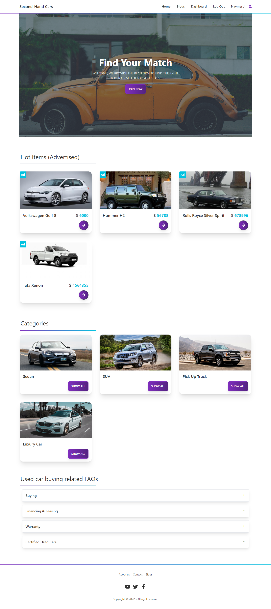

# Second-Hand Cars

## Table of contents

- [Overview](#overview)
  - [Screenshot](#screenshot)
  - [Links](#links)
- [Built with](#built-with)
- [Author](#author)

## Overview

Final Assignment for programming hero. A long and fun project. I have learned a lot so far. 

### Screenshot

### Links & Info

- [Solution Client side](https://github.com/programming-hero-web-course-4/b612-used-products-resale-clients-side-shamratPG)
- [Solution Server side](https://github.com/programming-hero-web-course-4/b612-used-products-resale-server-side-shamratPG)
- [Live Site](https://second-hand-cars-9aedb.web.app)
- [Live Server](https://second-hand-server-iota.vercel.app/)

- Here is an ADMIN login info for demo purpose.
- Admin Email: cristiano@ronaldo.com
- Admin Password: ronaldo123

## Built with

- MongoDb
- Express
- React
- Tailwind CSS
- Daisy UI
- FireBase
- React Router

## Author

- Website - [Md. Shamrat Hossain](https://github.com/shamratPG)
- Twitter - [@shamratpg](https://twitter.com/shamratpg)
